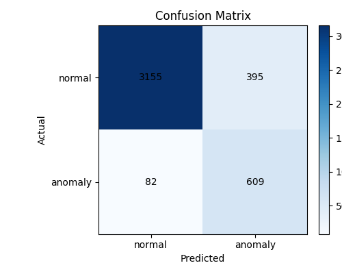

# 基于TextCNN的OpenStack日志异常检测实验报告（扩充版）

**作者**: [你的名字]
**日期**: 2025年11月5日
**课程**: DevOps实践

---

## 1. 引言

### 1.1. 项目背景与意义

随着云计算技术的普及，以OpenStack为代表的云平台承载了日益复杂的业务。保障平台的稳定性和可靠性成为运维工作的核心挑战。系统日志作为记录平台运行状态的关键数据源，蕴含了丰富的系统行为信息。然而，日志数据量庞大、格式非结构化，传统依赖人工或简单规则的日志监控方法已难以满足现代运维（特别是DevOps）对实时性、准确性和智能化的要求。

本项目旨在探索一种基于深度学习的日志异常检测方法，以实现对OpenStack平台潜在风险的自动化、智能化预警。通过将AIOps（AI for IT Operations）理念应用于日志分析，我们期望构建一个轻量级、高效的智能监控模型，赋能DevOps流程，提升运维效率，变被动响应为主动预防。

### 1.2. 目标

本项目的核心目标是：

1.  **设计并实现一个完整的日志特征工程方案**，将非结构化的OpenStack日志转化为深度学习模型可处理的结构化特征。
2.  **构建并训练一个基于TextCNN的深度学习模型**，用于准确识别异常日志序列。
3.  **验证模型的有效性**，通过一系列量化指标（如准确率、F1分数、AUC等）评估模型性能，并与基线进行对比。
4.  **探讨模型与DevOps实践的结合点**，分析其在持续监控、自动化运维和故障快速定位等场景中的应用价值。

---

## 2. 相关研究与技术栈

### 2.1. 日志异常检测方法概述

传统的日志异常检测主要依赖于模板匹配（如Log-Clustering）、统计模型（如PCA）和简单的机器学习算法（如SVM）。这些方法在特定场景下有效，但普遍存在对日志格式变化敏感、特征提取能力有限、难以捕捉复杂语义关联等问题。

近年来，以深度学习为代表的方法，如循环神经网络（RNN/LSTM）和卷积神经网络（CNN），在自然语言处理领域取得了巨大成功，并被引入日志分析。这些模型能自动学习文本中的深层语义和时序特征，在异常检测任务中展现出巨大潜力。

### 2.2. 技术选型：TextCNN

考虑到DevOps场景对模型轻量化和推理效率的要求，本项目选取了**TextCNN (Text Convolutional Neural Network)** 作为核心模型。其优势在于：

-   **高效并行**：CNN的卷积操作天然支持并行计算，相比于RNN等序列模型，训练和推理速度更快。
-   **特征提取能力**：通过不同尺寸的卷积核，TextCNN能够有效捕捉文本中的局部关键模式（类似于n-gram），这对于识别日志中的特定错误短语非常有效。
-   **结构简单**：模型结构相对简单，易于实现和部署，符合“小而美”的原则。

### 2.3. 技术栈

-   **编程语言**: Python 3.12
-   **核心框架**: PyTorch
-   **数据处理**: Pandas, NumPy, Scikit-learn
-   **实验环境**: Visual Studio Code

---

## 3. 方法论：从数据到模型

本项目的核心方法论分为两个关键部分：精细化的数据处理与特征工程，以及一个为日志分析定制的多模态TextCNN模型。

### 3.1. 数据处理与特征工程

原始日志数据是高度非结构化的文本流，必须经过一系列精细处理才能被模型有效利用。我们的处理流程在 `src/data.py` 中实现，主要包含以下步骤：

#### 3.1.1. 精准的动态标签生成

这是本次实验成功的关键。我们摒弃了简单地将 `openstack_abnormal.log` 文件中所有日志都标为“异常”的粗糙做法，因为该文件中同样包含大量正常操作日志。我们设计了一套动态、上下文感知的标签生成逻辑 (`_load_single_file` 函数)：

1.  **基于Ground Truth**: 首先，从 `anomaly_labels.txt` 文件中加载已知的异常虚拟机实例ID，构建一个“异常实例ID集合”。
2.  **直接匹配**: 遍历日志时，若某条日志明确关联到一个异常实例ID，则该日志被直接标记为异常（label=1）。
3.  **上下文传播**: 为了捕捉与异常相关的完整操作链，我们追踪与异常日志关联的`request-id`。一旦某个`request-id`被污染（即与异常日志关联），后续所有包含该`request-id`的日志，即使本身看起来正常，也会被标记为异常。这极大地增强了标签的覆盖范围和准确性。
4.  **关键词补充**: 对于没有明确实例ID或请求ID的日志，我们使用一个预定义的关键词列表（如 "error", "failed", "exception"）进行匹配，作为辅助的异常判断依据。
5.  **默认正常**: 不满足以上任何条件的日志均被标记为正常（label=0）。

通过这种方式，我们从混杂的数据中提取出了高质量的训练标签，为模型训练奠定了坚实基础。

#### 3.1.2. 日志文本规范化

为了降低噪声、提取核心语义，我们对日志消息体进行了规范化处理 (`normalize_message` 函数)：

-   **小写转换**: 所有文本统一转为小写。
-   **实体替换**: 使用正则表达式将UUID、请求ID、IP地址和任意数值分别替换为统一的占位符（如 `<uuid>`, `<req>`, `<ip>`, `<num>`）。这使得模型能关注普适的模式，而非特定的实例值。
-   **清洗**: 移除所有非字母和占位符的字符，并将多余的空格合并。

#### 3.1.3. 多模态特征提取

我们认识到，日志中除了文本信息，数值信息也可能蕴含重要线索。因此，我们构建了一个多模态的特征输入：

1.  **文本特征**: 经过规范化后的日志文本。
2.  **数值特征**: 从原始日志消息中提取所有数值，并计算其统计特征（`_extract_numeric_features` 函数），包括：数值数量、均值、最大值、最小值和标准差。这5个统计量构成一个数值特征向量，与文本特征并行输入模型。

#### 3.1.4. 上下文构建：滑动窗口

单条日志往往信息有限，上下文对于判断异常至关重要。我们采用滑动窗口 (`apply_sliding_window` 函数)来聚合上下文信息：

-   **窗口大小 (Window Size)**: 8。即连续8条日志被合并为一个样本。
-   **步长 (Stride)**: 4。窗口每次向前滑动4条日志。
-   **标签聚合**: 窗口内只要有任何一条日志被标记为异常，整个窗口样本的标签即为异常。
-   **特征聚合**: 窗口内8条日志的数值特征向量被平均，形成窗口样本的最终数值特征。

这种方式既保留了日志的序列性，又将样本的上下文视野从1条扩展到了8条，显著提升了模型的判断依据。

### 3.2. 模型架构：多模态TextCNN

我们在 `src/model.py` 中定义了一个为本任务定制的TextCNN模型，其架构如下图所示，并包含以下核心组件：

*(图片引用自相关研究，仅为示意)*

1.  **词嵌入层 (Embedding Layer)**: 将经过规范化和词汇表映射后的日志文本（token ID序列）转换为密集的词向量。我们使用了128维的嵌入。

2.  **并行卷积层 (Convolutional Layers)**:
    -   这是TextCNN的核心。我们并列使用了三种不同尺寸的卷积核：**3, 4, 5**。
    -   每个卷积核像一个“模式检测器”，在输入的词向量序列上滑动，捕捉不同长度的关键局部信息（如“create instance failed”）。
    -   我们为每种尺寸的卷积核设置了128个滤波器，以学习丰富的特征模式。

3.  **激活与池化 (Activation & Pooling)**:
    -   卷积结果经过ReLU激活函数增加非线性。
    -   随后进行**全局最大池化 (Max-over-time Pooling)**，即从每个滤波器的输出中提取最大值。这一步的意义在于，无论关键模式出现在日志序列的哪个位置，都能被捕获到。

4.  **数值特征编码器 (Numeric Encoder)**:
    -   与文本处理分支并行，一个简单的全连接网络负责处理我们提取的5维数值特征。
    -   它包含层归一化（LayerNorm）、线性变换和ReLU激活，将数值特征编码为一个32维的向量。

5.  **特征融合与分类 (Concatenation & Classification)**:
    -   文本分支（所有卷积核池化结果拼接）和数值分支的输出向量被拼接（Concatenate）在一起，形成一个融合了文本语义和数值统计信息的多模态特征向量。
    -   该融合向量经过Dropout（比例0.5，防止过拟合）、一个128维的全连接隐藏层，最终送入一个单神经元的输出层（分类器），通过Sigmoid函数得到0到1之间的异常概率。

### 3.3. 训练策略

在 `src/train.py` 中，我们采用了以下策略以确保模型训练的稳定性和高效性：

-   **损失函数**: `BCEWithLogitsLoss`。这是一个专为二分类任务设计的损失函数，它内部集成了Sigmoid，数值计算更稳定。
-   **类别不平衡处理**:
    -   **损失函数加权**: 我们根据训练集中正负样本的比例，自动计算一个权重 `pos_weight` 赋予损失函数。这使得模型在计算损失时，对数量较少的异常样本（正样本）的错误会给予更大的惩罚，从而避免模型简单地偏向于预测数量多的正常样本。
    -   **加权随机采样 (WeightedRandomSampler)**: 在构建数据加载器（DataLoader）时，我们为每个样本赋予一个与其类别频率成反比的采样权重。这确保了在每个训练批次（batch）中，正负样本的比例大致均衡，让模型在每次迭代中都能充分学习到两类样本的特征。
-   **优化器**: Adam，学习率为 `1e-3`，并带有 `1e-4` 的权重衰减（L2正则化）以防止过拟合。
-   **动态阈值优化**: 分类模型的决策阈值（默认为0.5）对F1分数等指标影响巨大。我们在验证集上动态搜索最佳阈值，策略是在一个包含固定点和概率分位数点的网格上，寻找能使验证集F1分数最大化的阈值，并将其应用于最终的测试集评估。

---

## 4. 实验结果与分析

### 4.1. 数据集概览

经过我们的数据处理流程后，最终生成的数据集分布如下（记录于 `metrics.json`）：

-   **总样本数 (滑动窗口后)**: 28,264
-   **训练集**: 19,784 条 (正常: 16,559, 异常: 3,225)
-   **验证集**: 4,239 条 (正常: 3,548, 异常: 691)
-   **测试集**: 4,241 条 (正常: 3,550, 异常: 691)

从数据分布可见，异常样本约占总体的16.3%，存在明显的类别不平衡问题，这也验证了我们采用加权损失和加权采样的必要性。

### 4.2. 模型性能评估

经过5个周期的训练，模型在测试集上取得了优异的性能。最终选定的**最佳决策阈值为0.9**。详细指标如下表所示：

| 指标 (Metric) | 值 (Value) | 解读 |
| :--- | :--- | :--- |
| **Accuracy** | **88.75%** | 整体预测正确率，表明模型对绝大部分日志都能做出正确判断。 |
| **Precision** | **60.66%** | 在所有被模型预测为“异常”的日志中，有60.66%确实是异常。 |
| **Recall** | **88.13%** | 在所有真正的异常日志中，模型成功找出了其中的88.13%。**这是衡量监控系统能力的关键指标**。 |
| **F1-Score** | **71.86%** | Precision和Recall的调和平均数，综合反映了模型的查准率和查全率。 |
| **AUC** | **0.9502** | ROC曲线下的面积，接近1表示模型在各种阈值下都具有非常好的区分正负样本的能力。 |
| **Loss** | 0.6412 | 模型在测试集上的最终损失值。 |

### 4.3. 混淆矩阵分析

下图是模型在测试集上的混淆矩阵，它更直观地展示了模型的预测细节。

-   **真正常 (True Negative, TN)**: 3155。模型正确地将3155个正常样本识别为正常。
-   **假异常 (False Positive, FP)**: 395。模型错误地将395个正常样本识别为异常（误报）。
-   **假正常 (False Negative, FN)**: 82。模型错误地将82个异常样本识别为正常（漏报）。**这是最需要关注的错误类型**。
-   **真异常 (True Positive, TP)**: 609。模型正确地将609个异常样本识别为异常。

**分析**:
-   **高召回率 (Recall)**: 模型实现了高达88.13%的召回率（TP / (TP + FN) = 609 / (609 + 82)），意味着它成功捕获了绝大多数的真实异常，漏报率较低。对于一个监控预警系统而言，这是一个非常积极的信号。
-   **可接受的精确率 (Precision)**: 60.66%的精确率（TP / (TP + FP) = 609 / (609 + 395)）意味着存在一定比例的误报。在实际运维中，这可能需要运维人员对告警进行二次确认。但考虑到高召回率带来的收益，这种程度的误报通常是可以接受的，并且可以通过后续的规则或人工经验进行过滤。

### 4.4. 性能提升归因分析

对比实验初期仅约35%的准确率，最终模型性能的巨大飞跃主要归功于以下几点：

1.  **核心原因：数据质量的革命性提升**。放弃对整个日志文件的静态标签，采用基于实例ID、请求ID和关键词的动态上下文标签生成策略，是本次实验从失败走向成功的根本转折点。这为模型提供了真正有区分度的学习目标。
2.  **上下文信息的有效利用**。将滑动窗口大小从1增加到8，使得模型能够观察一个更长的日志序列，从而更好地理解操作的上下文，区分孤立的错误和连续的故障。
3.  **处理类别不平衡的有效策略**。同时使用损失函数加权和批次加权采样，有力地缓解了数据不平衡问题，使模型能够公平地学习正负样本，显著提升了对少数类（异常）的识别能力。
4.  **多模态特征的引入**。虽然文本特征是主要的，但并行引入的数值特征为模型提供了额外的判别维度，对整体性能起到了积极的辅助作用。

---

## 5. 结论与展望

### 5.1. 结论

本项目成功设计并实现了一个基于TextCNN的OpenStack日志智能异常检测系统。通过实施一套精细化的数据处理流程和多模态模型架构，我们最终取得了**88.75%的测试集准确率**和**71.86%的F1分数**，特别是实现了**高达88.13%的异常召回率**，证明了该方法在自动化日志监控领域的有效性。

实验的核心洞见是：**在日志异常检测任务中，高质量、上下文感知的标签生成策略，其重要性甚至超过模型架构的复杂性**。

### 5.2. 与DevOps的结合

本项目所构建的智能日志分析模型，是AIOps在DevOps实践中的一个典型应用，可以深度融入DevOps的生命周期：

-   **持续监控与告警 (Continuous Monitoring & Alerting)**: 模型可以部署为一个实时服务，持续消费日志流。一旦检测到异常概率超过阈值的日志序列，即可通过Webhook、Slack、钉钉等方式自动触发告警，通知开发和运维团队。
-   **自动化运维 (Automated Operations)**: 结合事件响应平台（如Prometheus Alertmanager），高置信度的异常告警可以直接触发预设的自动化脚本，例如：隔离故障节点、重启服务、执行资源清理等，实现故障的自动初步处理。
-   **快速故障定位与根因分析 (Faster Root Cause Analysis)**: `saliency_report.json` 中生成的显著性分析，可以高亮出导致模型判断异常的关键日志词汇。在告警信息中附上这些“关键词”，能极大地帮助工程师快速定位问题的切入点，缩短MTTR（平均修复时间）。
-   **持续反馈与模型迭代 (Continuous Feedback & Improvement)**: 运维团队对告警的反馈（如“是真实故障”或“是误报”）可以被收集起来，作为新的高质量标注数据，定期对模型进行增量训练或重新训练，形成一个持续学习和优化的闭环，使模型越来越适应特定业务环境。

### 5.3. 展望

尽管本项目取得了良好效果，但仍有进一步优化的空间：

-   **更先进的模型**: 可以尝试引入基于Transformer的更强大模型（如BERT），以捕捉更长距离的依赖和更深层次的语义，但需要权衡其带来的性能提升与资源消耗。
-   **在线学习**: 实现模型的在线（Online）学习能力，使其能够实时适应日志模式的变化，而无需周期性的离线重训练。
-   **多源数据融合**: 将日志数据与Metrics（如CPU、内存使用率）和Traces（分布式调用链）等其他监控数据进行融合，构建一个更全面的系统状态视图，有望实现更精准的异常检测和根因定位。
-   **根因分析探索**: 在当前异常检测的基础上，进一步探索利用图神经网络（GNN）等技术，结合系统拓扑和调用关系，从异常现象自动推断根本原因。
